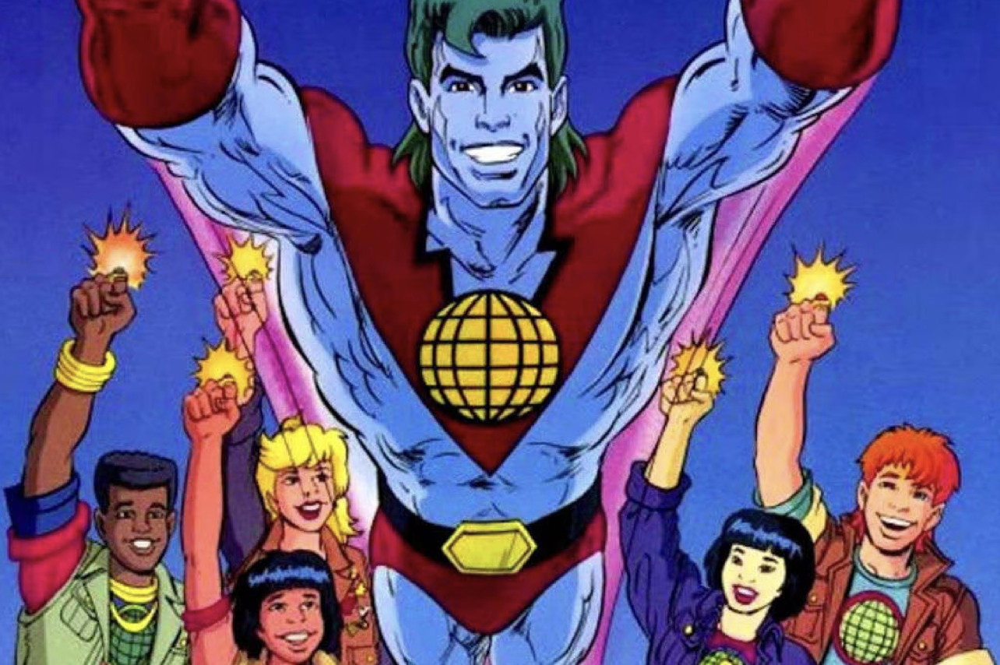
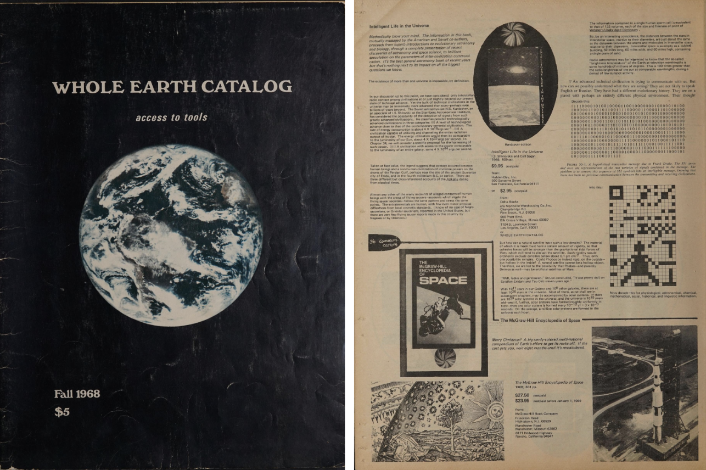
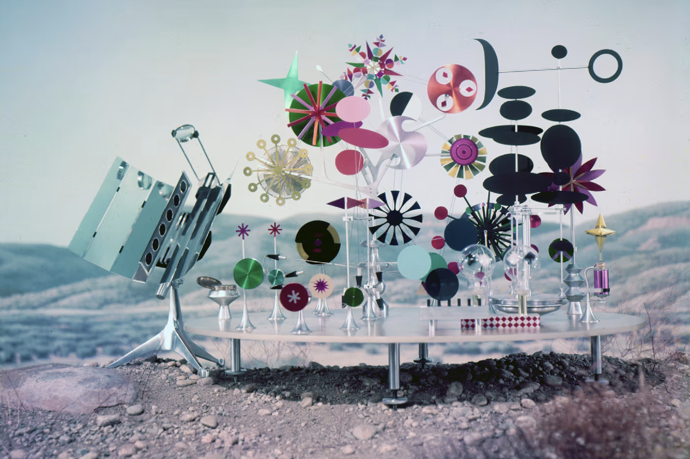
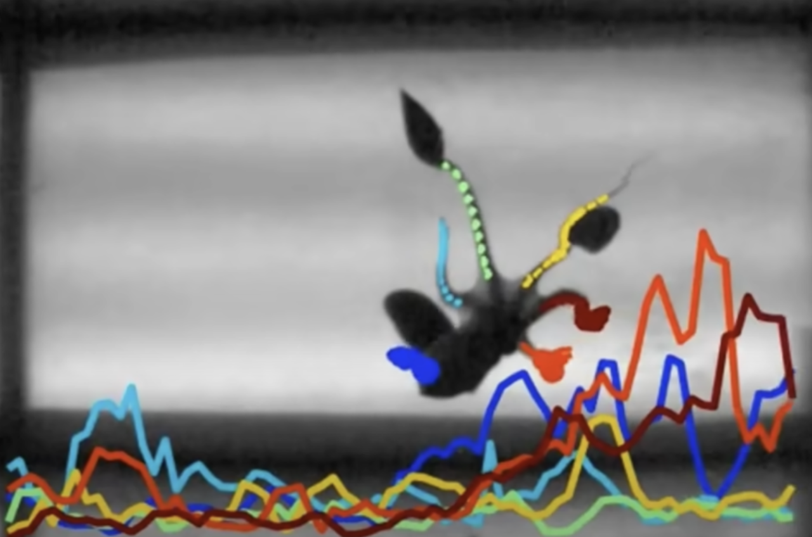
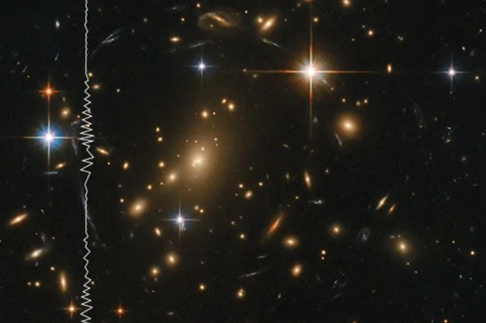
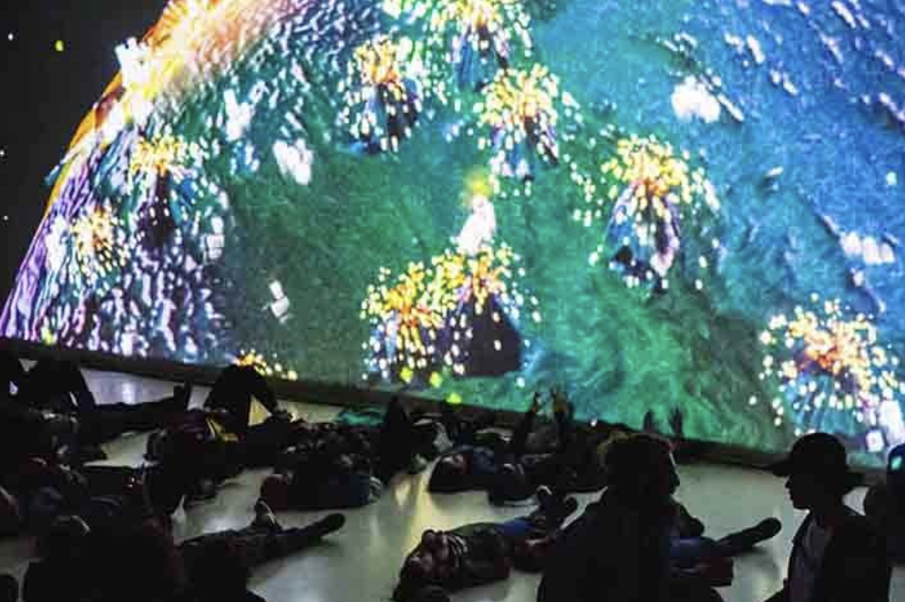
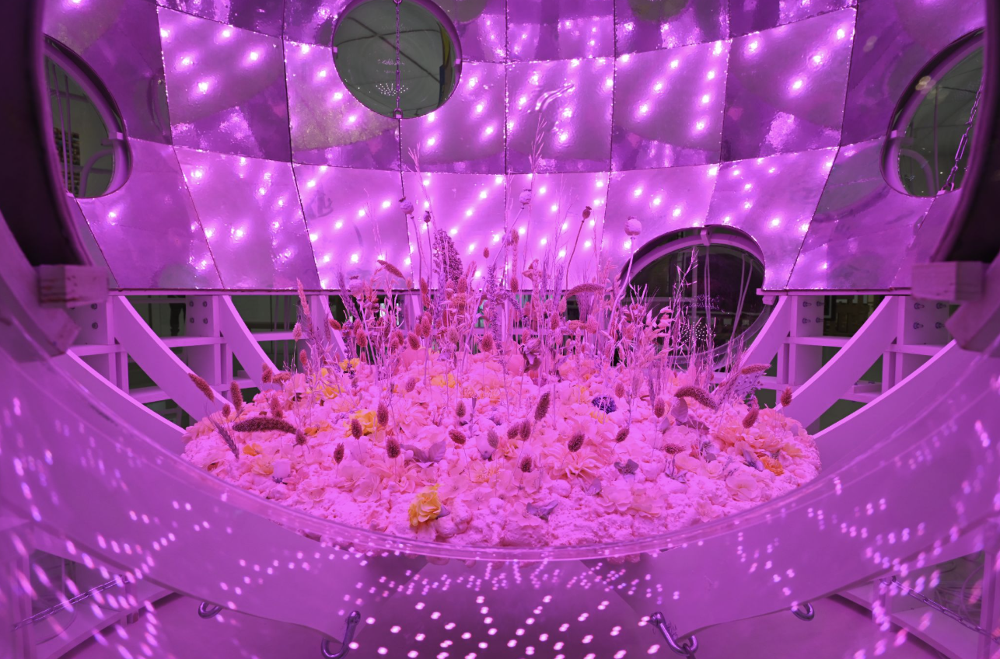

# Assignment 1
Do not have a clear direction at the moment but the general theme is Nature & Technology.

[View PDF](images/MA%20Media%20Design%20Thesis%20-%20A1%20-%20Nature%20&%20Technology.pdf)

[View Google Slides](https://docs.google.com/presentation/d/1IrseFcPhQiVu-LfUM_hxVDbaMHmqAJXAvp3G9LtminA/edit?usp=sharing)

## Research Questions
1. What processes should be in place to ethically create and consume technology?
2. How can we use existing lo-fi tech to understand the environment around us?
3. How can nature-based algorithms reveal aspects of nature?
4. How can connect and re-connect with space?
5. How can technology and nature have a symbiotic relationship?

 

## Terms and Topics

**Animal Locomotion**
- The study of how animals move through observation, recordings or computer programs.

**Anthropocene**
 A geological era where humans are the driving force for the structural changes on Earth.

**Biomimicry**
 Studying nature to solve complex human problems. Classic example are the hooks on bur fruits inspiring the invention of Velcro.

**Data Sonification**
 The process of taking raw data and producing sounds with them. There are different processes such as audification, earcons and parameter mapping.

**Lunar Effect**
 The moon’s phases throughout the 29.5-day cycle influencing human and non-humans.

**Philosophy of Technology**
 A sub-domain of philosophy examining the nature of technology and the impact on culture and society.

**Situated Practice**
 A design practice that’s contextual based in understanding the features and characteristics of the location and the inhabitants, whether human or non-human.

**Technosphere**
 Global network of humans being connected through technological systems.

**Wood Wide Web**
 The mycorrhizal network that lives underground in forests and plants where trees and plants use to share resources and communicate with one another.

 

## Visuals

### Captain Planet and the Planeteers

**Ted Turner, Barbara Pyle**

**1990–1996**

A cartoon where a group of teenagers unite from around the world to fight personified environmental villains.

[Source](https://captainplanetfoundation.org/about/our-story/captain-planet-the-planeteers-legacy/
)

 

### Whole Earth Catalog

**Stewart Brand**

**1968**

A catalog focused on providing the readers information about products through the form of reviews. Products were meant to help readers understand the environment, be self-sufficient, an alternative to traditional education through how-to-guides and DIY.

[Source](https://wholeearth.info/)

 

### Solar Do-Nothing Machine

**Charles & Ray Eames**

**1957**

Comissioned by Aluminun Company of America for the Forecast Program. Meant to highlight the versatility of the material. Here, is a playful sculpture using the material powered by the sun.

[Source](https://www.eamesoffice.com/the-work/solar-do-nothing-machine/)

 

### Researchers Model How Octopus Arms Make Decisions

**Dominic Sivitilli & David Gire, University of Washington**

**2019**

Scientists created a program to track octopus arm movements to infer that each tentacle are making decisions independently but can also be controlled by their nervous system when they are synchronized in movement. 

[Source](https://news.agu.org/press-release/researchers-model-how-octopus-arms-make-decisions/)

 

### Space Sonifications

**NASA**

**2021–2024**

To experience space imagery in a different way, NASA has sonified their photos. Data is transmitted back to NASA and this data doesn’t have to be in the form of imagery, but it can be used for sound. This process is caled data sonfication, by taking data points and mapping them to sound parameters.

[Source](https://science.nasa.gov/mission/hubble/multimedia/sonifications/)

 

### Chthuluscene

**Patricio Dávila, Immony Men, David Czarnoski, Symon Oliver, Bohdan Anderson, Maggie Chan**

**2015**
An interactive visualization where participants partner up through their mobile devices. When they do, entities start popping up in the projected world.

[Source](https://publicvisualizationstudio.co/projects/chthuluscene)

 

### Fellaria’s Time Capsule

**Mireia Luzárrag & Alejandro Muiño**

**2024**

Artists posed the question “What if plants could time-travel?”. In this piece, plants are inside a spaceship and viewers can peer through circular windows.

[Source](https://mudac.ch/en/projects/fellarias-time-capsule/)

 

## Events

**Fleuron** 
 An online conference dedicated to design, art, botany and technology. 
[Visit Site](https://fleuron.tf/)

**Biofabricate**
 A conference in NYC on sustainable biotechnology with a focus on materials. 
[Visit Site](https://www.biofabricate.co/)

 

## Preliminary Bibliography

AGU Newsroom. “Researchers Model How Octopus Arms Make Decisions.” Accessed April 28, 2025. https://news.agu.org/press-release/researchers-model-how-octopus-arms-make-decisions/.

Apple Podcasts. “Lost Worlds: Why Do We Have a Moon?” Accessed April 27, 2025. https://podcasts.apple.com/us/podcast/lost-worlds-why-do-we-have-a-moon/id1554578197?i=1000566482695.

Apple Podcasts. “Moon Genes.” Accessed April 27, 2025. https://podcasts.apple.com/dk/podcast/moon-genes/id1554578197?i=1000703712657.

Atlanta History Center. “Gone But Not Forgotten: Captain Planet,” April 4, 2024. https://www.atlantahistorycenter.com/blog/gone-but-not-forgotten-captain-planet/.

Benjamin Bratton: Presentation of The Stack (April 13, 2016), 2017. https://www.youtube.com/watch?v=cUhhHw_xS4w.

Block, Stefan Merrill. “The Disrupter’s Disrupter Tells Us to Ignore Our Instincts.” The New York Times, June 28, 2022, sec. Books. https://www.nytimes.com/2022/06/28/books/review/ways-of-being-james-bridle.html.

Bridle, James. New Dark Age: Technology and the End of the Future. Verso, 2018.
———. Ways of Being. Penguin Books, 2022.

Buckminster Fuller Institute. “World Design Science Decade,” December 28, 2022. https://www.bfi.org/about-fuller/world-design-science-decade/.

Campillo, Antonio. “In Praise of the Terrestrial Condition.” HannahArendt.Net 11, no. 1 (2021). https://doi.org/10.57773/hanet.v11i1.453.

Franssen, Maarten, Gert-Jan Lokhorst, and Ibo van de Poel. “Philosophy of Technology.” In The Stanford Encyclopedia of Philosophy, edited by Edward N. Zalta and Uri Nodelman, Fall 2024. Metaphysics Research Lab, Stanford University, 2024. https://plato.stanford.edu/archives/fall2024/entriesechnology/.

FutureLearn. “The Technological View of the World of Martin Heidegger.” Accessed April 27, 2025. https://www.futurelearn.com/info/blog.

Google Arts & Culture. “Computer Algorithms Inspired by Nature.” Accessed April 24, 2025.      
https://artsandculture.google.com/story/computer-algorithms-inspired-by-nature/-QWxa8aWfwXlQg.

Heidegger, Martin. “The Question Concerning Technology, and Other Essays,” n.d.

Issuu. “VLF: A Sound Artist&#39;s Guide, Second Edition,” July 4, 2015. https://issuu.com/dantappersoundart/docs/vlf_guide_4_upload.

Kahn, Peter H., Rachel L. Severson, and Jolina H. Ruckert. “The Human Relation With Nature and Technological Nature.” Current Directions in Psychological Science 18, no. 1 (February 2009): 37–42. https://doi.org/10.1111/j.1467-8721.2009.01602.x.

Kugler, Jolanthe, and Scott Longfellow. Objectif Terre – Le design de notre planète. Les presses du réel and le MUDAC, 2023.

Macfarlane, Robert. “The Secrets of the Wood Wide Web.” The New Yorker, August 7, 2016. https://www.newyorker.com/tech/annals-of-technology/the-secrets-of-the-wood-wide-web.

Mansoux, Aymeric, Brendan Howell, Dušan Barok, and Ville-Matias Heikkilä. “Permacomputing Aesthetics: Potential and Limits of Constraints in Computational Art, Design and Culture.” In Ninth Computing within Limits 2023. Virtual: LIMITS, 2023. https://doi.org/10.21428/bf6fb269.6690fc2e.

McKibben, Bill. The End of Nature. Random House, 1989.

Nature of Code.” Accessed April 24, 2025. https://natureofcode.com.

Nost, Eric. “Vocabularies for Technology, Nature, and the Anthropocene: A Conversation with Scott Kirsch.” Edge Effects, March 15, 2016. https://edgeeffects.net/technology-keyword-kirsch/.

Ramdya, Pavan, and Auke Jan Ijspeert. “The Neuromechanics of Animal Locomotion: From Biology to Robotics and Back.” Science Robotics 8, no. 78 (May 31, 2023): eadg0279. https://doi.org/10.1126/scirobotics.adg0279.

Todea, Luminița. “Technology Brands Inspired by Nature,” n.d.
Yeo, Sophie. Nature’s Ghosts: The World We Lost and How to Bring It Back. HarperCollins Publishers, 2024.

———. “The ‘Wood Wide Web’ Theory Charmed Us All – but Now It’s the Subject of a Bitter Fight among Scientists.” The Guardian, July 9, 2024, sec. Opinion. https://www.theguardian.com/commentisfree/article/2024/jul/09/wood-wide-web-theory-charmed-us-bitter-fight-scientists.

